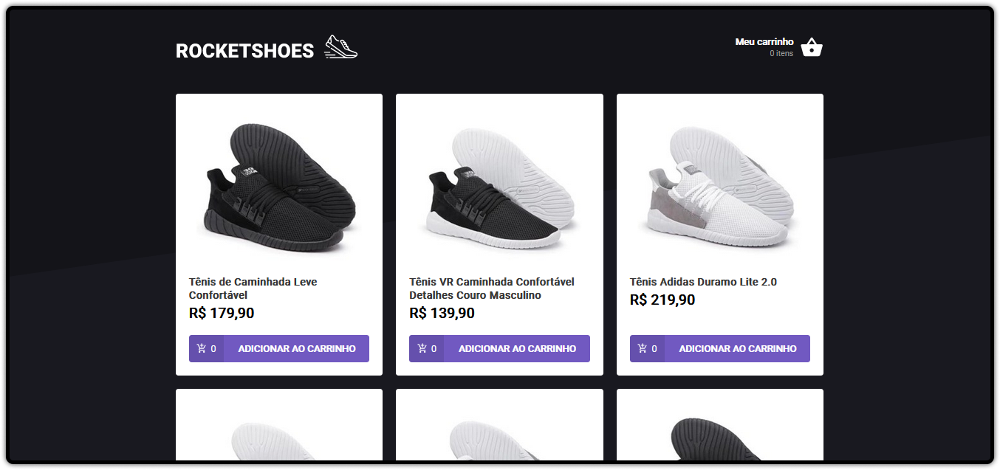

<h1 align="center">
    </img>
</h1>

 

  

## 🚀 Tecnologias

Esse projeto foi desenvolvido com as seguintes tecnologias:

- React.js
- TypeScript
- SASS
- Babel
- Webpack
- React hooks

## 💻 Projeto

Essa é uma aplicação onde o seu principal objetivo é criar um hook de carrinho de compras. Tive acesso a duas páginas, um componente e um hook para implementar as funcionalidades pedidas nesse desafio:

- Adicionar um novo produto ao carrinho; ✅
- Remover um produto do carrinho; ✅
- Alterar a quantidade de um produto no carrinho; ✅
- Cálculo dos preços sub-total e total do carrinho; ✅
- Validação de estoque; ✅
- Exibição de mensagens de erro; ✅
- Entre outros. ✅

## 🔖 Layout

Elaborado pela equipe da Rocketseat.

## Licença

Esse projeto está sob a licença MIT. Veja o arquivo [LICENSE](LICENSE.md) para mais detalhes.

